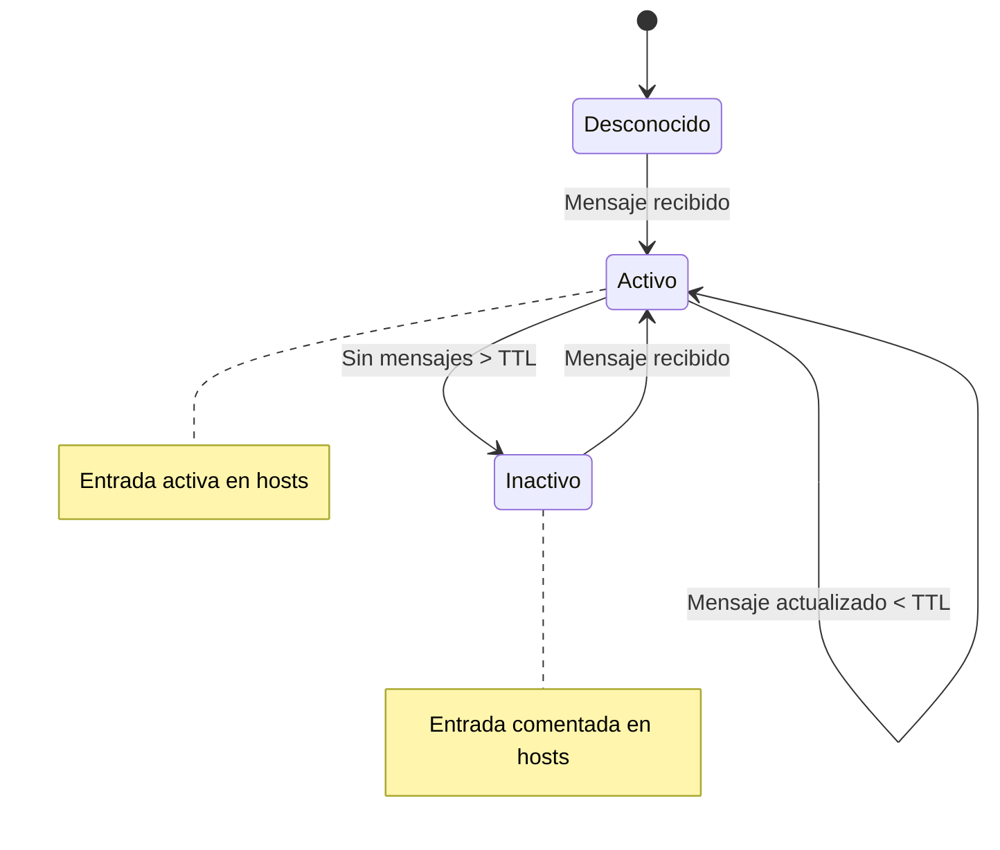
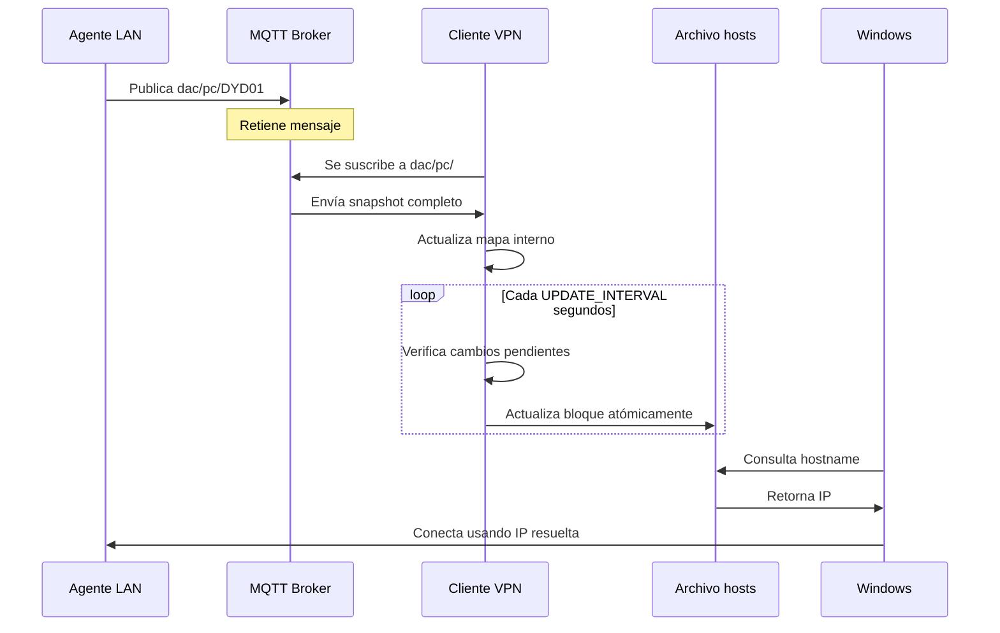

# Cliente VPN - Actualizador Automático de Hosts

Cliente Python que se suscribe a topics MQTT y mantiene actualizado automáticamente el archivo `hosts` de Windows con las IPs de los equipos de la red interna.

## 🎯 Propósito

Resolver el problema de resolución de nombres (hostname → IP) en conexiones VPN donde:
- ❌ No hay DNS interno confiable
- ❌ No se propagan broadcasts (NetBIOS/mDNS)
- ✅ Pero existe conectividad IP completa
- ✅ Y hay un broker MQTT accesible

## 📋 Cómo Funciona


### Flujo de Datos

1. **Agentes LAN** publican su estado en `dac/pc/{hostname}`
2. **Broker MQTT** retiene el último mensaje de cada host
3. **Cliente VPN** recibe todos los mensajes (snapshot completo)
4. **Cliente construye mapa** de hostname → IP + timestamp
5. **Actualiza archivo hosts** con un bloque dedicado
6. **Windows resuelve nombres** usando el archivo hosts

## 🔧 Instalación

### 1. Requisitos Previos

- Python 3.8+ con `paho-mqtt` instalado
- Privilegios de **Administrador**
- Archivo `.env` con credenciales MQTT

### 2. Configurar `.env`

Usa el mismo archivo `.env` que el agente:

```env
MQTT_BROKER=98f1261f32ac495eb8a03d003a78b5b2.s1.eu.hivemq.cloud
MQTT_PORT=8883
MQTT_USERNAME=dacdns
MQTT_PASSWORD=tu_contraseña_aqui
HOSTS_UPDATE_INTERVAL=30
HOST_TTL_MINUTES=5
```

### Variables adicionales:

| Variable | Descripción | Default |
|----------|-------------|---------|
| `HOSTS_UPDATE_INTERVAL` | Segundos entre actualizaciones de hosts | `30` |
| `HOST_TTL_MINUTES` | Minutos antes de considerar host inactivo | `5` |

### 3. Ejecutar Cliente

**IMPORTANTE:** Debe ejecutarse como **Administrador**

```powershell
# Clic derecho en PowerShell → "Ejecutar como administrador"
.\iniciar_cliente_vpn.bat
```

O directamente:

```powershell
.venv\Scripts\python.exe cliente_vpn.py
```

## 📁 Archivo Hosts

### Ubicación

```
C:\Windows\System32\drivers\etc\hosts
```

### Estructura del Bloque

El cliente mantiene un bloque claramente delimitado:

```
# --- BEGIN MQTT-HOSTS ---
192.168.1.41    DYD01
192.168.1.20    NAS
192.168.1.15    LAPTOP-05
# 192.168.1.50    PC-VIEJA  # Inactivo desde 2026-01-08T12:30:00+00:00
# --- END MQTT-HOSTS ---
```

**Características:**

- ✅ **Todo fuera del bloque permanece intacto**
- ✅ **Escritura atómica** (archivo temporal → rename)
- ✅ **Hosts inactivos se comentan** automáticamente
- ✅ **Idempotente**: puede regenerarse completamente

## 🔄 Comportamiento

### Estados de Hosts



### Criterios de Actividad

Un host se considera **activo** si:
- Su último mensaje tiene menos de `HOST_TTL_MINUTES` minutos

Un host se considera **inactivo** si:
- Su último mensaje tiene más de `HOST_TTL_MINUTES` minutos
- La entrada en hosts se **comenta** pero no se elimina

### Actualización del Archivo

El archivo hosts se actualiza cuando:
- ✅ Se recibe un mensaje nuevo o cambio de IP
- ✅ Han pasado `HOSTS_UPDATE_INTERVAL` segundos desde la última actualización
- ✅ Se cierra el programa (actualización final)

**No se actualiza** en cada mensaje individual (se agrupa para eficiencia).

## 📊 Logging

### Niveles de Log

| Nivel | Eventos |
|-------|---------|
| **INFO** | Conexión, hosts nuevos, cambios de IP, actualizaciones |
| **WARNING** | Desconexiones, payloads incompletos |
| **ERROR** | Errores de permisos, conexión, parsing |
| **DEBUG** | Actualizaciones sin cambios, mensajes ignorados |

### Ejemplo de Log Normal

```
========================================================
Cliente VPN - Actualizador Automático de Hosts
========================================================
[INFO] Archivo hosts: C:\Windows\System32\drivers\etc\hosts
[INFO] Broker MQTT: 98f1261f32ac495eb8a03d003a78b5b2.s1.eu.hivemq.cloud:8883
[INFO] Intervalo de actualización: 30s
[INFO] TTL de hosts: 5 minutos
[INFO] Conectando al broker MQTT...
[INFO] ✓ Conectado al broker MQTT
[INFO] ✓ Suscrito a topic: dac/pc/#
[INFO] ✓ Suscripción confirmada
[INFO] ✓ Cliente iniciado correctamente
[INFO] Esperando mensajes MQTT...
[INFO] ➕ Nuevo host: DYD01 = 192.168.1.41
[INFO] ➕ Nuevo host: NAS = 192.168.1.20
[INFO] Actualizando archivo hosts: C:\Windows\System32\drivers\etc\hosts
[INFO] ✓ Hosts actualizado: 2 activos, 0 inactivos
```

### Ejemplo de Cambio de IP

```
[INFO] 📍 DYD01: 192.168.1.41 → 192.168.1.42
[INFO] Actualizando archivo hosts: C:\Windows\System32\drivers\etc\hosts
[INFO] ✓ Hosts actualizado: 2 activos, 0 inactivos
```

## 🔐 Seguridad y Permisos

### Verificación de Privilegios

El programa verifica automáticamente que se ejecute como Administrador:

```python
if not IsUserAnAdmin():
    log.error("ERROR: Este script requiere privilegios de administrador")
    sys.exit(1)
```

### Protección del Archivo Hosts

- ✅ Escritura atómica (evita corrupción)
- ✅ Solo modifica el bloque delimitado
- ✅ Preserva configuración existente
- ✅ Backup implícito (archivo temporal antes de reemplazar)

### Restricción de Permisos en `.env`

```powershell
icacls .env /inheritance:r
icacls .env /grant:r "%USERNAME%:F"
icacls .env /grant:r "SYSTEM:F"
```

## 🚀 Configurar como Tarea Programada

### Crear Tarea (PowerShell como Administrador)

```powershell
$action = New-ScheduledTaskAction -Execute "D:\proyectos\dac\dacdns\iniciar_cliente_vpn.bat" -WorkingDirectory "D:\proyectos\dac\dacdns"

$trigger = New-ScheduledTaskTrigger -AtStartup

$principal = New-ScheduledTaskPrincipal -UserId "SYSTEM" -LogonType ServiceAccount -RunLevel Highest

$settings = New-ScheduledTaskSettingsSet -AllowStartIfOnBatteries -DontStopIfGoingOnBatteries -StartWhenAvailable -RestartCount 3 -RestartInterval (New-TimeSpan -Minutes 1)

Register-ScheduledTask -TaskName "ClienteVPN_Hosts" -Action $action -Trigger $trigger -Principal $principal -Settings $settings -Description "Actualiza archivo hosts con IPs de MQTT"
```

**IMPORTANTE:** 
- Usar `-UserId "SYSTEM"` para acceso completo a `hosts`
- O usar tu usuario con `-LogonType Password` y proporcionar la contraseña

### Verificar Tarea

1. Abrir `taskschd.msc`
2. Buscar "ClienteVPN_Hosts"
3. Clic derecho → "Ejecutar"
4. Verificar en el historial que se ejecuta correctamente

## 🛠️ Troubleshooting

### Problema: "ERROR: Este script requiere privilegios de administrador"

**Solución:**
- Clic derecho en PowerShell → "Ejecutar como administrador"
- O clic derecho en `iniciar_cliente_vpn.bat` → "Ejecutar como administrador"

### Problema: "ERROR: Sin permisos para escribir en hosts"

**Solución:**
- Verificar que se ejecuta como Administrador
- Verificar que el archivo no esté abierto en otro programa
- Verificar que no haya bloqueos de antivirus

### Problema: El archivo hosts no se actualiza

**Causas posibles:**
1. No hay mensajes MQTT llegando
   - Verificar que los agentes LAN estén publicando
   - Verificar conectividad con el broker
2. TTL muy corto y hosts aparecen como inactivos
   - Aumentar `HOST_TTL_MINUTES` en `.env`
3. Intervalo de actualización muy largo
   - Reducir `HOSTS_UPDATE_INTERVAL` en `.env`

### Problema: "Conexión rechazada (rc=Not authorized)"

**Solución:**
- Verificar credenciales en `.env`
- Usar las mismas credenciales que el agente LAN

### Problema: Windows no resuelve los nombres

**Diagnóstico:**

1. Verificar que el bloque existe en hosts:
   ```powershell
   notepad C:\Windows\System32\drivers\etc\hosts
   ```

2. Limpiar caché DNS:
   ```powershell
   ipconfig /flushdns
   ```

3. Probar resolución:
   ```powershell
   ping DYD01
   nslookup DYD01
   ```

4. Verificar orden de resolución:
   - Windows busca primero en `hosts`
   - Luego consulta DNS
   - El archivo hosts tiene prioridad

## 📈 Métricas de Rendimiento

| Métrica | Valor |
|---------|-------|
| **Latencia de actualización** | 1-30 segundos (configurable) |
| **Hosts soportados** | Sin límite práctico |
| **Uso de CPU** | < 0.1% (idle) |
| **Uso de RAM** | ~20 MB |
| **Uso de red** | < 0.5 KB/min |
| **Tamaño bloque hosts** | ~40 bytes por host |

## ⚙️ Configuración Avanzada

### Cambiar TTL de Hosts

Editar `.env`:

```env
HOST_TTL_MINUTES=10  # 10 minutos antes de marcar inactivo
```

### Cambiar Frecuencia de Actualización

Editar `.env`:

```env
HOSTS_UPDATE_INTERVAL=10  # Actualizar cada 10 segundos
```

**⚠️ Nota:** Valores muy bajos pueden causar escrituras excesivas en disco.

### Personalizar Marcadores del Bloque

Editar en `cliente_vpn.py`:

```python
BEGIN_MARKER = "# --- BEGIN MY-CUSTOM-BLOCK ---"
END_MARKER = "# --- END MY-CUSTOM-BLOCK ---"
```

## 🔄 Flujo Completo de Actualización



## 🎯 Ventajas de Esta Solución

| Aspecto | Ventaja |
|---------|---------|
| **Independencia** | No depende de QVPN ni su configuración |
| **Simplicidad** | Solo modifica el archivo hosts |
| **Compatibilidad** | Funciona con RDP, SMB, SSH, etc. |
| **Determinismo** | Estado conocido, no heurístico |
| **Escalabilidad** | Soporta cientos de hosts sin problemas |
| **Resiliencia** | Si MQTT cae, último hosts sigue funcionando |
| **Visibilidad** | Archivo hosts es legible y auditable |

## 🚨 Limitaciones

- ❌ Requiere privilegios de Administrador
- ❌ Solo funciona en Windows (por uso de archivo hosts específico)
- ❌ No resuelve dinámicamente (caché de 1-30 segundos)
- ❌ No soporta IPv6 (extensible fácilmente)

## 📚 Referencias

- [Documentación Paho MQTT](https://www.eclipse.org/paho/index.php?page=clients/python/docs/index.php)
- [Formato del archivo hosts](https://en.wikipedia.org/wiki/Hosts_(file))
- [Tareas Programadas de Windows](https://docs.microsoft.com/en-us/windows/win32/taskschd/task-scheduler-start-page)

---

## 👤 Autor

Sistema desarrollado para resolver resolución de nombres en VPN sin DNS interno.
