# DACDNS - Agente de Actualización Dinámica de DNS

Agente Python que publica automáticamente el hostname e IP de un equipo Windows en un broker MQTT (HiveMQ Cloud), permitiendo el rastreo dinámico de dispositivos en la red.

## 📋 Descripción Funcional

DACDNS es un servicio ligero que se ejecuta en segundo plano y publica periódicamente el nombre del equipo (hostname) y su dirección IP en un topic MQTT específico. Está diseñado para ejecutarse como tarea programada en Windows y mantener actualizada la ubicación de equipos en redes con IPs dinámicas.

### Características principales:

- ✅ Conexión segura TLS/SSL a broker MQTT
- ✅ Publicación periódica configurable (por defecto cada 60 segundos)
- ✅ Reconexión automática ante fallos de red
- ✅ Manejo robusto de errores sin interrumpir el servicio
- ✅ Configuración mediante variables de entorno
- ✅ Logging detallado de todas las operaciones
- ✅ Salida limpia mediante señales de sistema

---

## 🔄 Flujo Normal de Operación

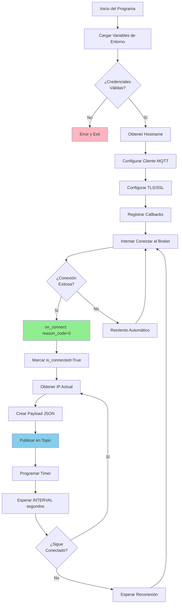

## 🛡️ Cliente VPN (Actualizador de hosts)

El proyecto incluye también un **Cliente VPN** que se suscribe a los topics MQTT publicados por los agentes LAN y mantiene actualizado, de forma atómica, el archivo `hosts` de Windows con las entradas `hostname -> ip`.

### 🎯 Propósito

Resolver la resolución de nombres en conexiones VPN donde no hay DNS interno ni propagación de broadcasts, aprovechando el broker MQTT como fuente de verdad.

### Cómo funciona (diagrama)

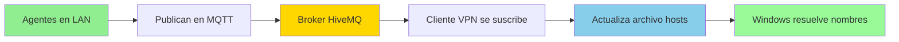

### Flujo resumido

1. Los agentes LAN publican en `dac/pc/{hostname}` con retain=true.
2. El broker retiene el último mensaje de cada host.
3. El Cliente VPN recibe el snapshot y construye un mapa `hostname -> {ip,timestamp}`.
4. El Cliente actualiza el bloque delimitado en `C:\Windows\System32\drivers\etc\hosts` de forma atómica.
5. Las entradas inactivas se comentan en lugar de eliminarse (TTL configurable).

### Configuración clave en `.env`

Además de las variables del agente, el cliente utiliza:

```env
HOSTS_UPDATE_INTERVAL=30
HOST_TTL_MINUTES=5
```

### Bloque en `hosts`

El cliente mantiene un bloque delimitado que preserva el resto del archivo:

```
# --- BEGIN MQTT-HOSTS ---
192.168.1.41    DYD01
192.168.1.20    NAS
# 192.168.1.50    PC-VIEJA  # Inactivo desde 2026-01-08T12:30:00+00:00
# --- END MQTT-HOSTS ---
```

### Diagrama de estados (hosts)

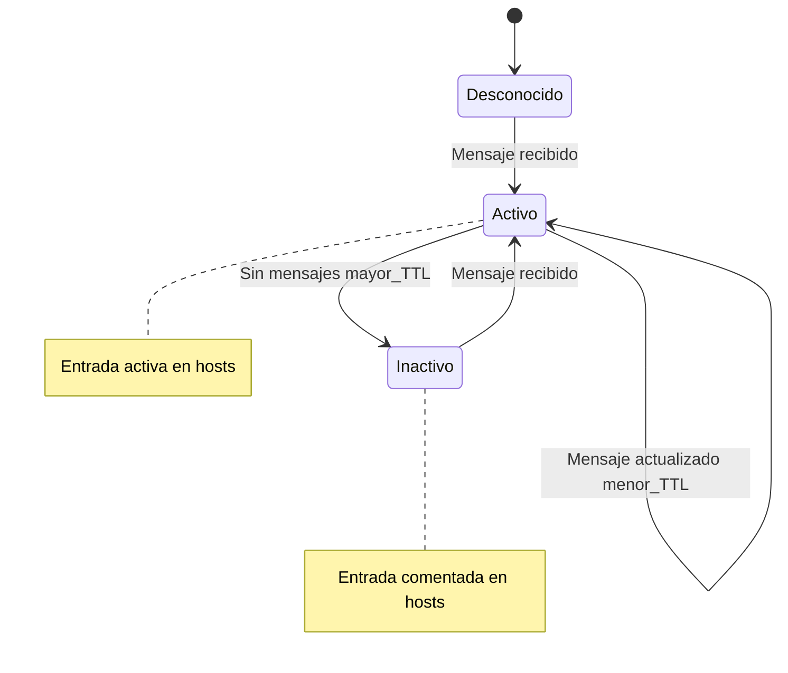

> Nota: Los marcadores del bloque (`BEGIN`/`END`) y la escritura atómica evitan corrupción del `hosts`.

### Ejecución (Administrador requerido)

```powershell
# Ejecutar como Administrador

```

### Crear tarea programada (ejemplo)

```powershell
$action = New-ScheduledTaskAction -Execute "D:\proyectos\dac\dacdns\iniciar_cliente_vpn.bat" -WorkingDirectory "D:\proyectos\dac\dacdns"
$trigger = New-ScheduledTaskTrigger -AtStartup
$principal = New-ScheduledTaskPrincipal -UserId "SYSTEM" -LogonType ServiceAccount -RunLevel Highest
$settings = New-ScheduledTaskSettingsSet -AllowStartIfOnBatteries -DontStopIfGoingOnBatteries -StartWhenAvailable -RestartCount 3 -RestartInterval (New-TimeSpan -Minutes 1)
Register-ScheduledTask -TaskName "ClienteVPN_Hosts" -Action $action -Trigger $trigger -Principal $principal -Settings $settings -Description "Actualiza archivo hosts con IPs de MQTT"
```

### Troubleshooting rápido
- Verificar ejecución como Administrador.
- Asegurarse que `.env` tiene las mismas credenciales que el agente.
- Comprobar que los agentes publican en `dac/pc/#`.
- Revisar logs para errores de permisos o conexión.

---

### Descripción del flujo normal:

1. **Inicio**: El programa carga las variables de entorno desde `.env`
2. **Validación**: Verifica que existan `MQTT_USERNAME` y `MQTT_PASSWORD`
3. **Configuración**: Establece conexión TLS/SSL con el broker
4. **Conexión**: Intenta conectar con reintentos automáticos
5. **Publicación**: Una vez conectado, publica el estado inmediatamente
6. **Ciclo**: Programa un timer para republicar cada N segundos
7. **Mantenimiento**: El loop mantiene la conexión activa indefinidamente

---

## ⚠️ Flujos Alternativos - Manejo de Errores

### 1. Error en Credenciales

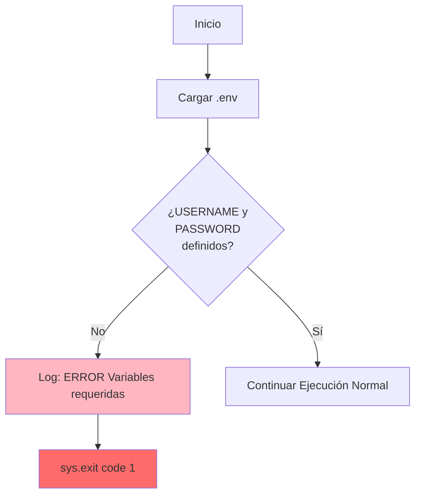

**Síntoma**: El programa termina inmediatamente al iniciar  
**Causa**: No existe el archivo `.env` o faltan las variables  
**Solución**: Verificar que `.env` existe y contiene las credenciales

---

### 2. Error de Conexión al Broker

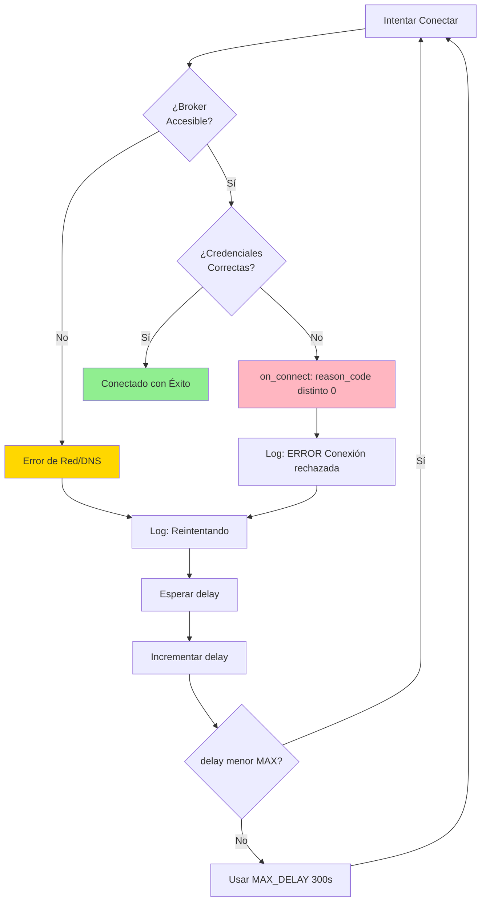

**Comportamiento**:
- Sin red: Reintenta con backoff exponencial (1s → 2s → 4s → ... → 300s)
- Credenciales inválidas: Reintenta indefinidamente (puede ser temporal)
- El programa **nunca termina**, solo reintenta

---

### 3. Error al Obtener IP

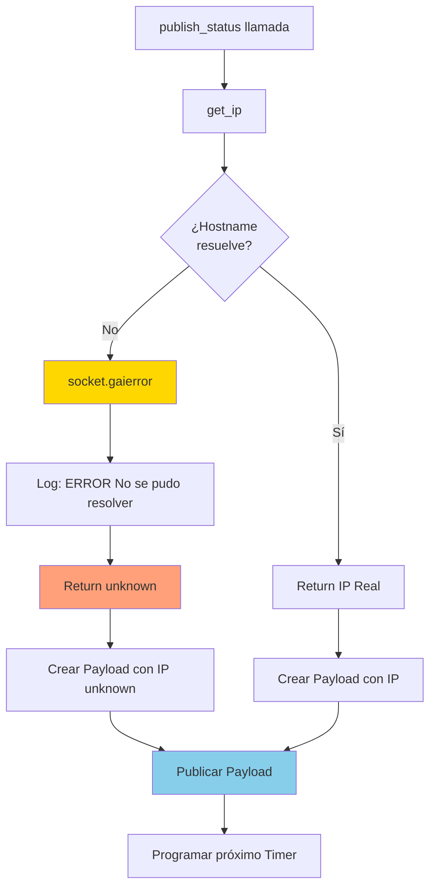

**Comportamiento**:
- Si falla resolver la IP, publica `"ip": "unknown"`
- El servicio **continúa ejecutándose**
- Reintentará obtener la IP en la próxima publicación

---

### 4. Pérdida de Conexión Durante Operación

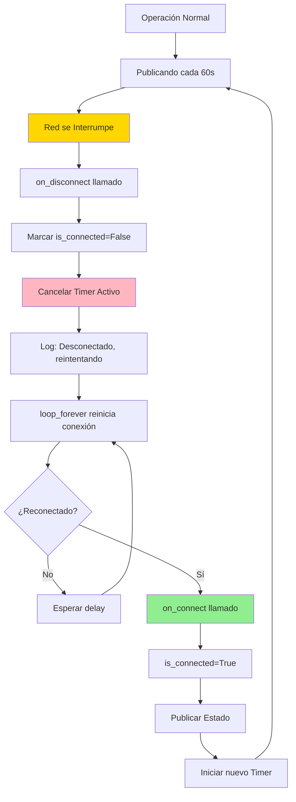

**Comportamiento**:
- Detecta desconexión inmediatamente
- Cancela timers pendientes (evita publicar sin conexión)
- Reconecta automáticamente
- Resume publicaciones al reconectar

---

### 5. Error al Publicar Mensaje

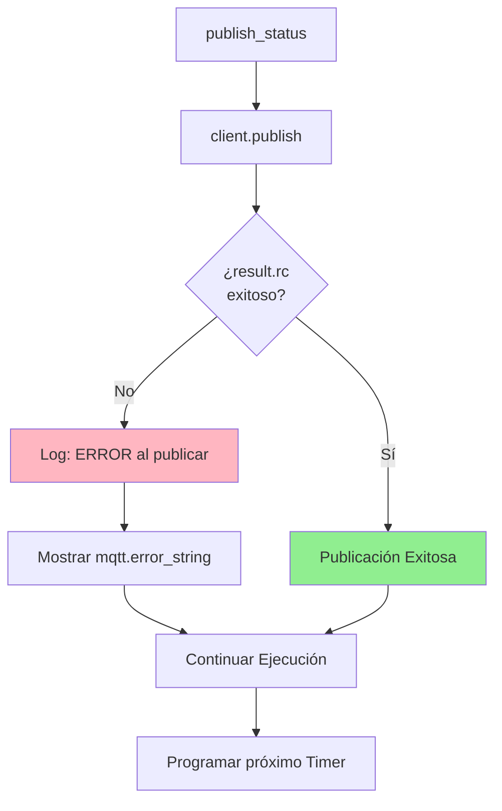

**Comportamiento**:
- Si falla la publicación, loguea el error
- El servicio **continúa ejecutándose**
- Reintentará en la próxima iteración

---

### 6. Señal de Cierre (Ctrl+C o Kill)

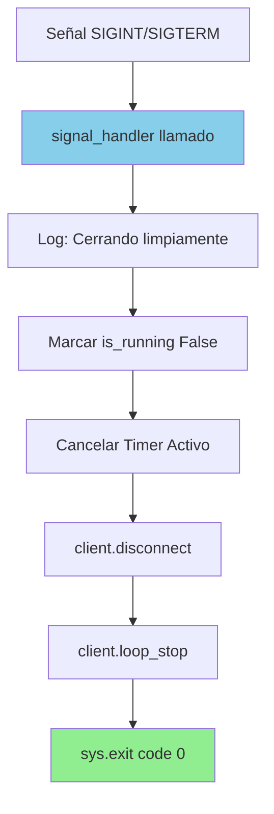

**Comportamiento**:
- Captura Ctrl+C, kill, o cierre de terminal
- Cancela timers pendientes
- Desconecta limpiamente del broker
- Sale con código 0 (éxito)

---

## 🏗️ Arquitectura del Sistema

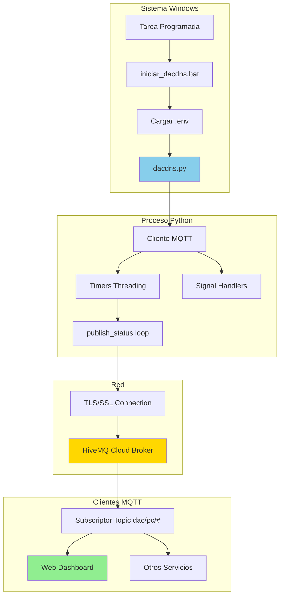

---

## 📊 Datos Publicados

### Topic MQTT
```
dac/pc/{HOSTNAME}
```

Ejemplo: `dac/pc/DYD01`

### Payload (JSON)
```json
{
  "hostname": "DYD01",
  "ip": "192.168.1.41",
  "timestamp": "2026-01-08T18:24:38.298456+00:00"
}
```

**Campos:**
- `hostname`: Nombre del equipo Windows
- `ip`: Dirección IP actual (o "unknown" si no se puede resolver)
- `timestamp`: Fecha y hora en formato ISO 8601 (UTC)

### Configuración QoS
- **QoS**: 1 (at least once)
- **Retain**: True (último mensaje guardado en broker)

---

## ⚙️ Configuración

### Variables de Entorno (archivo `.env`)

| Variable | Descripción | Valor por Defecto | Requerido |
|----------|-------------|-------------------|-----------|
| `MQTT_BROKER` | Hostname del broker MQTT | `98f1261f32ac495eb8a03d003a78b5b2.s1.eu.hivemq.cloud` | No |
| `MQTT_PORT` | Puerto TLS del broker | `8883` | No |
| `MQTT_USERNAME` | Usuario para autenticación | - | **Sí** |
| `MQTT_PASSWORD` | Contraseña de autenticación | - | **Sí** |
| `UPDATE_INTERVAL` | Segundos entre publicaciones | `60` | No |

### Ejemplo de archivo `.env`
```env
MQTT_BROKER=98f1261f32ac495eb8a03d003a78b5b2.s1.eu.hivemq.cloud
MQTT_PORT=8883
MQTT_USERNAME=dacdns
MQTT_PASSWORD=tu_contraseña_aqui
UPDATE_INTERVAL=60
```

---

## 🔍 Estados del Sistema

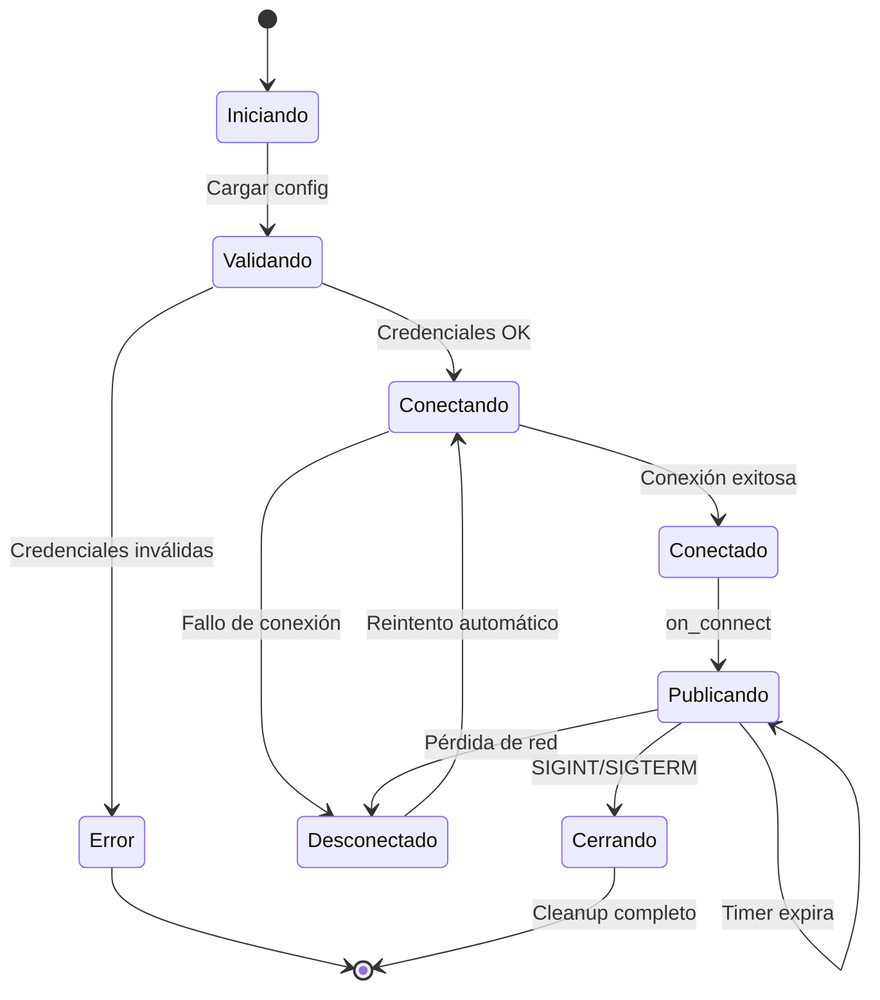

### Descripción de estados:

- **Iniciando**: Cargando configuración y validando
- **Conectando**: Intentando establecer conexión con broker
- **Conectado**: Conexión activa, listo para publicar
- **Publicando**: Estado normal, publicando periódicamente
- **Desconectado**: Sin conexión, reintentando automáticamente
- **Cerrando**: Cleanup antes de terminar
- **Error**: Credenciales faltantes, terminación inmediata

---

## 📝 Logging

El programa genera logs detallados de todas las operaciones:

### Niveles de Log

| Nivel | Eventos |
|-------|---------|
| **INFO** | Inicio, conexión exitosa, publicaciones, configuración |
| **WARNING** | Desconexiones, eventos recuperables |
| **ERROR** | Errores de conexión, autenticación, publicación |

### Ejemplo de Log Normal
```
2026-01-08 14:24:37,281 [INFO] Iniciando agente dacdns
2026-01-08 14:24:37,282 [INFO] Hostname: DYD01
2026-01-08 14:24:37,282 [INFO] Topic: dac/pc/DYD01
2026-01-08 14:24:37,283 [INFO] Broker: 98f1261f32ac495eb8a03d003a78b5b2.s1.eu.hivemq.cloud:8883
2026-01-08 14:24:37,283 [INFO] Intervalo de actualización: 60s
2026-01-08 14:24:37,284 [INFO] Conectando al broker MQTT...
2026-01-08 14:24:38,297 [INFO] ✓ Conectado y autorizado en MQTT
2026-01-08 14:24:38,298 [INFO] Publicando estado: {'hostname': 'DYD01', 'ip': '192.168.1.41', 'timestamp': '2026-01-08T18:24:38.298456+00:00'}
2026-01-08 14:25:38,310 [INFO] Publicando estado: {'hostname': 'DYD01', 'ip': '192.168.1.41', 'timestamp': '2026-01-08T18:25:38.310123+00:00'}
```

### Ejemplo de Log con Reconexión
```
2026-01-08 14:26:15,120 [WARNING] Desconectado del broker (rc=7), reintentando...
2026-01-08 14:26:16,150 [INFO] ✓ Conectado y autorizado en MQTT
2026-01-08 14:26:16,151 [INFO] Publicando estado: {'hostname': 'DYD01', 'ip': '192.168.1.41', 'timestamp': '2026-01-08T18:26:16.151234+00:00'}
```

---

## 🚀 Ejecución

### Ejecución Manual
```bash
# Activar entorno virtual y ejecutar
.venv\Scripts\python.exe dacdns.py
```

### Ejecución con Script
```bash
.\iniciar_dacdns.bat
```

### Como Tarea Programada
Ver [INSTALACION.md](INSTALACION.md) para configurar como servicio de Windows.

---

## 🛠️ Dependencias

- **Python**: 3.8+
- **paho-mqtt**: Cliente MQTT
- **ssl**: Comunicación TLS/SSL (built-in)
- **threading**: Timers periódicos (built-in)
- **signal**: Manejo de señales (built-in)

### Instalación de dependencias
```bash
pip install paho-mqtt
```

---

## 🔐 Seguridad

### Prácticas implementadas:

- ✅ Credenciales en variables de entorno (no hardcodeadas)
- ✅ Archivo `.env` excluido de Git
- ✅ Conexión TLS/SSL al broker
- ✅ QoS 1 para garantizar entrega de mensajes
- ✅ Validación de credenciales al inicio

### Recomendaciones adicionales:

1. Restringir permisos del archivo `.env`:
   ```powershell
   icacls .env /inheritance:r
   icacls .env /grant:r "%USERNAME%:F"
   ```

2. Usar un usuario dedicado de Windows para la tarea programada

3. Rotar credenciales MQTT periódicamente

---

## 📈 Métricas de Rendimiento

| Métrica | Valor |
|---------|-------|
| **Intervalo de actualización** | 60 segundos (configurable) |
| **Tiempo de reconexión** | 1s → 300s (backoff exponencial) |
| **Tamaño de payload** | ~90 bytes |
| **Uso de CPU** | < 0.1% (idle) |
| **Uso de RAM** | ~15 MB |
| **Uso de red** | < 1 KB/min |

---

## 🐛 Troubleshooting

### Problema: "ERROR: Variables de entorno requeridas"
**Solución**: Crear archivo `.env` con credenciales válidas

### Problema: "Conexión rechazada (rc=Not authorized)"
**Solución**: Verificar usuario/contraseña en HiveMQ Cloud

### Problema: "No se pudo resolver IP"
**Solución**: Verificar configuración de DNS del sistema

### Problema: La tarea programada no inicia
**Solución**: 
1. Verificar permisos del usuario
2. Revisar ruta absoluta en la tarea
3. Comprobar que `.env` es accesible

---

## 📄 Licencia

Este proyecto es de uso interno para DAC.

---

## 👤 Autor

Sistema desarrollado para monitoreo de equipos en red dinámica.
